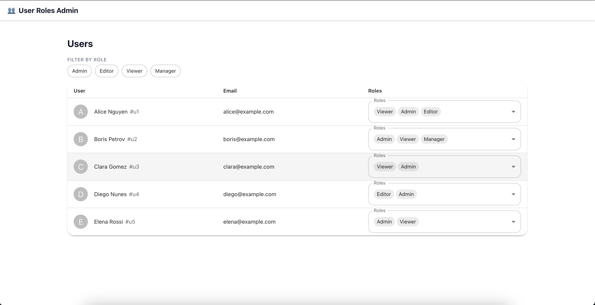

# Belitsoft Test Task

Test assignment for the Full Stack Engineer position at Belitsoft.



## Tech Stack

* [React 19](https://react.dev/)
* [TypeScript](https://www.typescriptlang.org/)
* [Vite](https://vitejs.dev/)
* [MUI](https://mui.com/)
* [Sass/SCSS](https://sass-lang.com/)
* [Axios](https://axios-http.com/)
* [React Router v7](https://reactrouter.com/)
* ESLint + TypeScript ESLint

## Installation

```bash
# Clone the repository
git clone https://github.com/ivanmikhniukdev-ctrl/belitsoft-test-task

# Go to project directory
#
# install the client's dependencies:
cd belitsoft-test-task/client
npm install

# install the server's dependencies:
cd belitsoft-test-task/server
npm install

```

## Scripts
# 
# Client:
* `npm run dev` — start development server
* `npm run build` — build production bundle (tsc + vite)
* `npm run preview` — preview the production build locally
* `npm run lint` — run ESLint checks
* `npm run lint:fix` — auto-fix ESLint issues
#
# Server:
* `npm run dev` — start development server
* `npm run start` — start server
* `npm run build` — build server app


## Development
Before starting the client-app, you need to run server:

```bash
cd belitsoft-test-task/server
npm install
npm run build
npm run start
```

After that you need to run front-end:

```bash
cd belitsoft-test-task/client
npm install
npm run dev
```

the project will be available at:

[http://localhost:5173](http://localhost:5173)


---

Author: **Ivan Mikhniuk**
